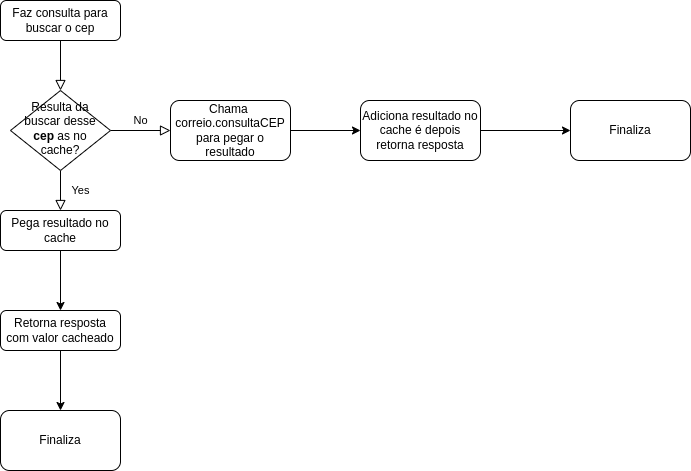

O que é cache?
==============

Imagine cache como sendo um atalho para chegar naquela informação, reduzido o tempo para
obter aquela informação

Sobre o pacote cache-manager?
===============================

Esse pacote do **npm** interessante, pois você pode alterar o mecanismo de cache de **memory** para **redis** que é um banco de dados usado para cache, é você não irá precisar mexer no seu código para fazer alterações onde está trabalhando com o cache.

Imagem abaixo explica o fluxo para cachear a informações como você precisa:
============================================================================

